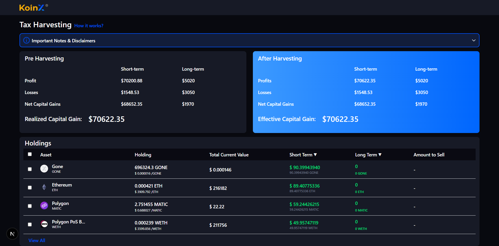

## 🛠️ Setup Instructions for Next.js React Project

Follow these steps to set up the project locally:

### 1. Clone the Repository

```bash
git clone https://github.com/amankumar033/koinx.git
cd koinx
```

### 2. Install Dependencies

Using npm:

```bash
npm install
```

Or using Yarn:

```bash
yarn install
```

### 3. Start Development Server

```bash
npm run dev
```

The app will be running at: [http://localhost:3000](http://localhost:3000)

### 4. Build for Production

```bash
npm run build
```

### 5. Start Production Server

```bash
npm start
```

### 6. (Optional) Lint the Code

```bash
npm run lint
```
## Features

- Fully **Responsive Design** for Desktop, Tablet, and Mobile views  
- **View Less / View More** toggles to control content visibility  
- Interactive **Dropdown** and **Dropup** menus for better UX  
- Clean UI with smooth transitions and animations

---

## Screenshots

### Desktop View (Full)


### Desktop View (More)


### Desktop View (Less)


### Desktop View (Drop down)


### Tablet View


### Mobile View (Less)


